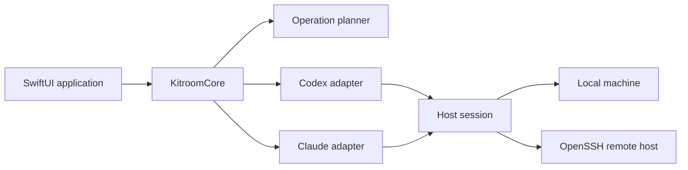

<p align="center">
  
</p>

<h1 align="center">Kitroom</h1>

<p align="center"><strong>A macOS control centre for coding-agent extensions.</strong></p>

<p align="center">
  <a href="https://github.com/l0cka/kitroom/actions/workflows/ci.yml"></a>
  <a href="https://www.swift.org/"></a>
  <a href="https://developer.apple.com/macos/"></a>
  <a href="LICENSE"></a>
</p>

Kitroom is an open-source native macOS project for managing the skills,
plugins, MCP servers, and configuration used by coding agents. It is designed
to work on the Mac running Kitroom and on remote macOS or Linux hosts over
OpenSSH. Claude Code and Codex are the first integrations.

The name comes from the room where equipment is stored, checked, maintained,
and issued. Kitroom treats skills, plugins, and MCP servers as equipment:
capabilities that should have a known source, an explicit destination, and a
verifiable state.

## Project status

Kitroom is in active early development. The repository currently contains:

- a tracked Xcode macOS application with a provisional app icon;
- a native sidebar shell for hosts, inventory, catalogue, activity, and
  settings;
- normalized package, capability, installation, inventory, and evidence models;
- bounded local process execution and OpenSSH transport with bounded standard
  input for reviewed remote transfers;
- local and remote host discovery with explicit failure states;
- OpenSSH-alias setup that preserves the user's keys and host trust;
- read-only Codex and Claude inventories for plugins, skills, MCP servers,
  configuration state, and plugin-provided components;
- read-only native catalogue browsing with source, version, component,
  compatibility, integrity, and update evidence;
- host comparison for package versions, enabled state, source, digest, and
  host-only capabilities;
- optional project-aware scanning from a selected working directory to its Git
  root;
- per-item scope, origin, effective state, freshness, and evidence status;
- durable SwiftData storage for hosts and bounded scan history;
- inventory search and filters, source and evidence inspection, stale-state
  warnings, and redacted diagnostic export;
- an approval-first operation model with expiring digest-bound plans;
- guarded local standalone-skill install, update, and uninstall for Codex and
  Claude Code, with exact-target backup, atomic exchange, fresh verification,
  rollback, and durable activity history;
- guarded native plugin install and uninstall for Claude Code and Codex,
  Claude Code enable, disable, and update, and source-drift checks before
  catalogue-backed changes;
- guarded add and remove for credential-free HTTPS Codex MCP servers, while
  blocking plugin-provided servers from the direct-configuration path;
- guarded remote standalone-skill install, update, and uninstall for Codex and
  Claude Code, with bounded digest evidence, atomic replacement, retained
  backups, and fresh verification;
- guarded remote Claude Code plugin install, update, enable, disable, and
  uninstall, plus Codex plugin install and uninstall, using exact native
  commands and configuration rollback evidence;
- guarded remote add and remove for credential-free HTTPS Codex MCP servers;
- explicit package-source allowances, manifest-digest requirements, operation
  history, and confirmed local-backup deletion controls;
- unit tests and project documentation.

The Hosts screen verifies platform details and agent availability. Inventory
and Catalogue run fresh read-only scans, preserve recent history, and label
unverified, stale, or incomplete state explicitly. Catalogue can compare
installed state between two hosts without changing either one. Guarded local
operations cover standalone skills, the agent-supported native plugin matrix,
and credential-free HTTPS Codex MCP servers on local and SSH-connected hosts.
Every path uses an expiring plan, fresh preflight inventory, configuration or
content backup, post-change verification, and a durable activity record.

## Product principles

1. **Inspect before changing.** Inventory comes from the target host at the
   time of use.
2. **Preview every mutation.** Kitroom shows the exact host, files, commands,
   and expected effect before execution.
3. **Verify the result.** An operation is not complete until the target is
   inspected again.
4. **Preserve provenance.** Hand-managed, marketplace-installed,
   plugin-provided, and runtime-injected capabilities remain distinguishable.
5. **Use native trust boundaries.** Local secrets belong in Keychain; remote
   access should reuse OpenSSH configuration and keys.
6. **Fail closed.** Unknown state is never rendered as healthy, installed, or
   absent.

## Initial scope

### Hosts

- The Mac running Kitroom
- Remote macOS or Linux hosts reachable through an OpenSSH host alias

### Agents

- OpenAI Codex
- Anthropic Claude Code

### Managed capabilities

- Skills
- Plugins
- MCP servers
- Agent configuration that determines how those capabilities are loaded

### Operations

- Browse and search
- Inspect installed state and origin
- Compare hosts
- Preview an install, update, disable, or uninstall
- Apply an approved plan
- Verify and record the resulting state

## Architecture



Agent-specific logic is isolated behind adapters. Host-specific execution is
isolated behind sessions. This lets the same inventory and operation workflow
work locally and remotely without pretending that Claude and Codex use
identical configuration formats.

See the [Implementation plan](docs/IMPLEMENTATION_PLAN.md),
[Architecture](docs/ARCHITECTURE.md), [Product](docs/PRODUCT.md),
[Security](docs/SECURITY.md), [Design guide](docs/DESIGN-GUIDE.md), and
[Roadmap](docs/ROADMAP.md). Beta preparation is tracked in the
[Release checklist](docs/RELEASE_CHECKLIST.md), with separate
[Privacy](docs/PRIVACY.md) and
[Accessibility](docs/ACCESSIBILITY_AUDIT.md) notes.

## Requirements

- macOS 14 or later
- Xcode 16 or a compatible Swift 6 toolchain
- OpenSSH configuration for any remote host

## Build and run

```bash
swift build
swift test
swift run Kitroom
```

The Swift package remains available for core development and tests. To run the
native application, open `Kitroom.xcodeproj` and use the shared `Kitroom`
scheme. To build the app bundle from the command line:

```bash
xcodebuild \
  -project Kitroom.xcodeproj \
  -scheme Kitroom \
  -configuration Debug \
  CODE_SIGNING_ALLOWED=NO \
  build
```

Run the complete local verification:

```bash
./scripts/verify.sh
```

## Repository layout

```text
.
├── AGENTS.md
├── Assets/
│   └── Brand/                  # Logo and identity assets
├── LICENSE
├── Kitroom.xcodeproj/          # Native macOS application project
├── Package.swift
├── README.md
├── Sources/
│   ├── KitroomApp/            # SwiftUI composition and presentation
│   │   └── Resources/         # App icon, logo, and color assets
│   └── KitroomCore/
│       ├── Adapters/          # Claude and Codex boundaries
│       ├── Domain/            # Hosts, packages, capabilities, inventory, operations
│       └── Infrastructure/    # Local/SSH host-session contracts
├── Tests/
│   ├── KitroomCoreTests/
│   └── SandboxProbe/          # Reproducible App Sandbox feasibility probe
├── docs/
│   ├── decisions/             # Architecture decision records
│   ├── ARCHITECTURE.md
│   ├── ACCESSIBILITY_AUDIT.md
│   ├── DESIGN-GUIDE.md
│   ├── IMPLEMENTATION_PLAN.md
│   ├── PRIVACY.md
│   ├── PRODUCT.md
│   ├── RELEASE_CHECKLIST.md
│   ├── ROADMAP.md
│   └── SECURITY.md
└── scripts/                   # Verification and sandbox-probe builders
```

## Contributing

Read [AGENTS.md](AGENTS.md) before making changes. The central safety rule is
that inspection can be automatic, while any mutation must be represented by an
immutable plan, shown to the user, explicitly approved, applied to the exact
target, and verified afterward.

## License

Kitroom is available under the [MIT License](LICENSE).
