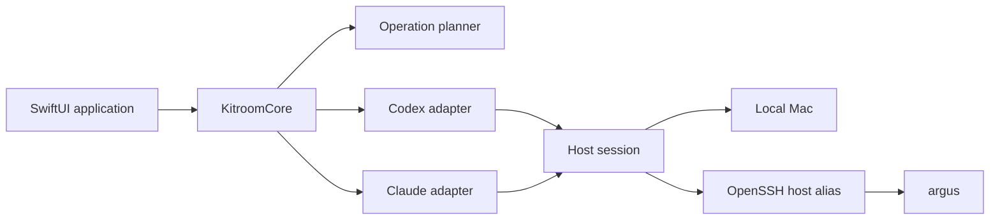

# Kitroom

**Equip every coding agent, on every machine.**

Kitroom is a native macOS application for browsing, inspecting, installing,
updating, disabling, and uninstalling extensions used by coding agents. The
first supported agents are Claude Code and Codex; the first supported hosts are
the local Mac and SSH-accessible servers such as `argus`.

The name comes from the room where equipment is stored, checked, maintained,
and issued. Kitroom treats skills, plugins, and MCP servers as equipment:
capabilities that should have a known source, an explicit destination, and a
verifiable state.

## Project status

Kitroom is at the scaffold stage. The repository currently contains:

- a buildable SwiftUI macOS application shell;
- domain models for hosts, agents, extensions, inventory, and operations;
- local and SSH host abstractions;
- initial Codex and Claude adapter boundaries;
- an approval-first operation model;
- unit tests and project documentation.

Inventory collection and mutating operations are deliberately not wired up
yet. The UI labels unverified state as **Not scanned** rather than presenting
placeholder data as live state.

## Product principles

1. **Inspect before changing.** Inventory comes from the target host at the
   time of use.
2. **Preview every mutation.** Kitroom shows the exact host, files, commands,
   and expected effect before execution.
3. **Verify the result.** An operation is not complete until the target is
   inspected again.
4. **Preserve provenance.** Hand-managed, marketplace-installed,
   plugin-provided, and runtime-injected capabilities remain distinguishable.
5. **Use native trust boundaries.** Local secrets belong in Keychain; remote
   access should reuse OpenSSH configuration and keys.
6. **Fail closed.** Unknown state is never rendered as healthy, installed, or
   absent.

## Initial scope

### Hosts

- This Mac
- Remote macOS or Linux hosts reachable through an OpenSSH host alias
- `argus` as the first real remote-host integration

### Agents

- OpenAI Codex
- Anthropic Claude Code

### Managed capabilities

- Skills
- Plugins
- MCP servers
- Agent configuration that determines how those capabilities are loaded

### Operations

- Browse and search
- Inspect installed state and origin
- Compare hosts
- Preview an install, update, disable, or uninstall
- Apply an approved plan
- Verify and record the resulting state

## Architecture



Agent-specific logic is isolated behind adapters. Host-specific execution is
isolated behind sessions. This lets the same inventory and operation workflow
work locally and remotely without pretending that Claude and Codex use
identical configuration formats.

See the [Implementation plan](docs/IMPLEMENTATION_PLAN.md),
[Architecture](docs/ARCHITECTURE.md), [Product](docs/PRODUCT.md),
[Security](docs/SECURITY.md), and [Roadmap](docs/ROADMAP.md).

## Requirements

- macOS 14 or later
- Xcode 16 or a compatible Swift 6 toolchain
- OpenSSH configuration for any remote host

## Build and run

```bash
swift build
swift test
swift run Kitroom
```

Or open `Package.swift` in Xcode.

Run the complete local verification:

```bash
./scripts/verify.sh
```

## Repository layout

```text
.
├── AGENTS.md
├── Package.swift
├── README.md
├── Sources/
│   ├── KitroomApp/            # SwiftUI composition and presentation
│   └── KitroomCore/
│       ├── Adapters/          # Claude and Codex boundaries
│       ├── Domain/            # Hosts, extensions, inventory, operations
│       └── Infrastructure/    # Local/SSH host-session contracts
├── Tests/
│   └── KitroomCoreTests/
├── docs/
│   ├── decisions/             # Architecture decision records
│   ├── ARCHITECTURE.md
│   ├── PRODUCT.md
│   ├── ROADMAP.md
│   └── SECURITY.md
└── scripts/
    └── verify.sh
```

## Contributing

Read [AGENTS.md](AGENTS.md) before making changes. The central safety rule is
that inspection can be automatic, while any mutation must be represented by an
immutable plan, shown to the user, explicitly approved, applied to the exact
target, and verified afterward.

## License

No licence has been selected yet. Until one is added, the project remains
all-rights-reserved by default.
