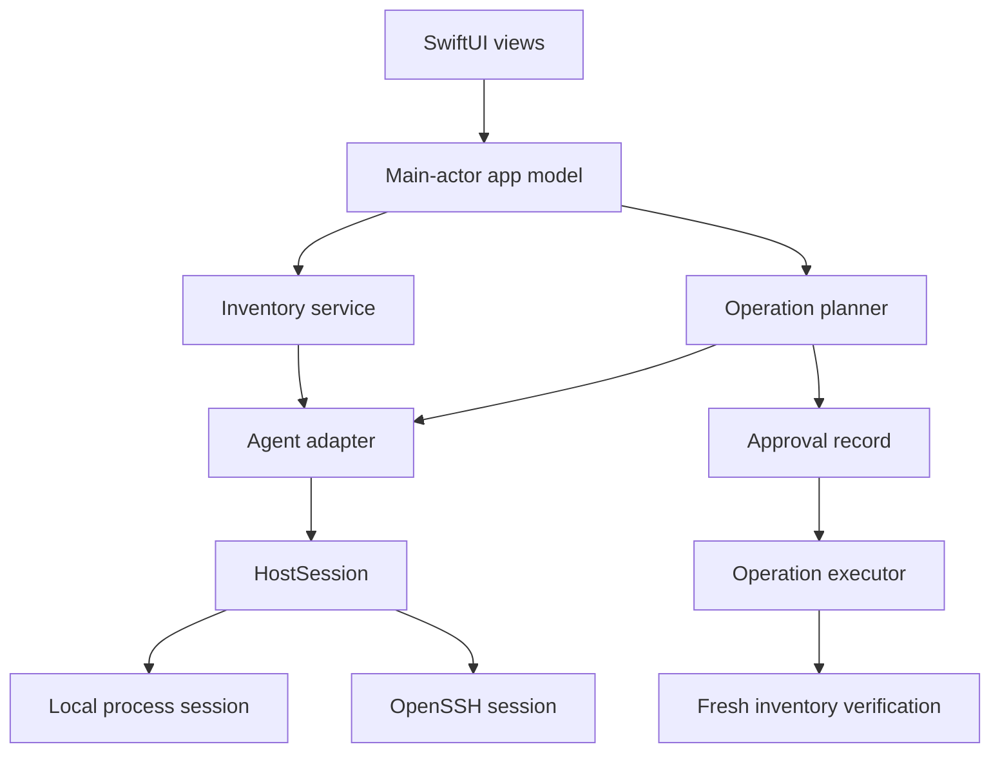
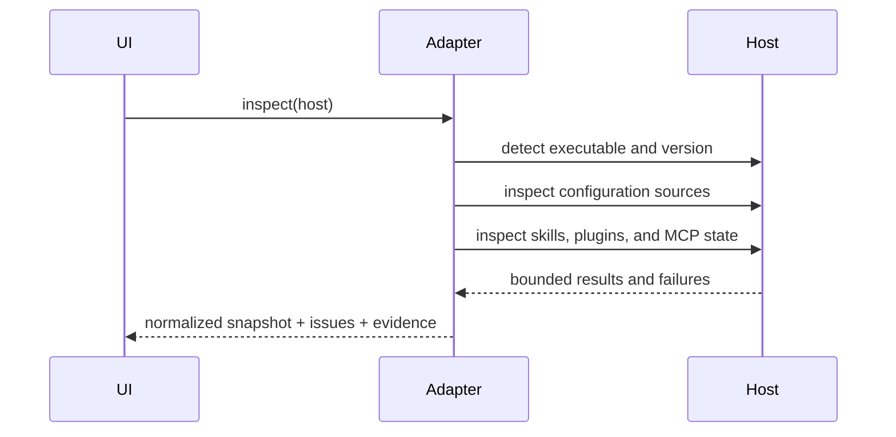

# Architecture

## System shape

Kitroom is a native macOS application with a UI target and a platform-neutral
core library. It connects to the local machine or to a remote host through the
user's OpenSSH configuration.



## Layers

### KitroomApp

Owns presentation, navigation, user interaction, accessibility, and main-actor
state. Views work with normalized core models and never construct shell
commands.

The tracked Xcode project produces `Kitroom.app` and embeds `KitroomCore` as a
framework. Swift Package Manager remains the fast path for core builds, tests,
and command-line development runs.

### KitroomCore.Domain

Contains immutable, `Sendable` values:

- `ManagedHost`
- `HostDiscoverySnapshot`
- `AgentKind`
- `CatalogSource`
- `PackageRecord`
- `ProvidedCapability`
- `InstallationRecord`
- `EvidenceRecord`
- `InventorySnapshot`
- `CatalogueSnapshot`
- `HostComparisonItem`
- `OperationPlan`

Unknown, partial, and unavailable states are first-class values.

### KitroomCore.Adapters

Each adapter understands one agent's:

- executable and capability discovery;
- configuration hierarchy;
- skills, plugins, and MCP surfaces;
- inventory formats;
- supported native operations;
- verification rules.

Candidate paths guide discovery but never prove installation by themselves.

### KitroomCore.Infrastructure

`HostSession` is the execution boundary shared by local and SSH connections.
Requests use an absolute executable plus an argument array, an explicit
environment allowlist, a timeout, and output limits. Local execution never
invokes an implicit shell. The SSH transport encodes those values into one
strictly quoted POSIX command because OpenSSH's remote-command protocol passes
through the remote login shell.

The implemented boundaries are:

- `SystemProcessExecutor`, backed by `Process`, with bounded concurrent output,
  timeout, cancellation, exit, and signal reporting;
- `LocalHostSession`, which forwards structured requests;
- `SSHHostSession`, backed by `/usr/bin/ssh`, BatchMode, a validated existing
  alias, and the user's existing host-key policy;
- `SSHConfigurationResolver`, which exposes only a bounded resolved summary;
- `HostDiscoveryService`, which produces explicit reachable, partial,
  authentication, identity-change, unreachable, and cancelled states;
- fake and fixture sessions used by the transport tests.

## Inventory

An inventory scan is a collection of independently evidenced probes. A scan can
be complete, partial, or unavailable.



Raw command output should not become the public domain model. Adapters parse it
into normalized values and retain bounded evidence references for diagnostics.
Each displayed package, capability, and installation links back to one or more
versioned evidence records. Skill, plugin, and MCP identities remain distinct
even when the UI presents them in one hierarchy.

An optional absolute working directory enables repository-aware discovery.
Kitroom asks Git for the repository root, walks configuration and skill layers
from that root to the selected directory, and passes every path as data to a
structured host-session request.

## Catalogues and comparison

Catalogue scans use the same adapter and host-session boundaries as inventory.
Each adapter reads its agent's available-package listing and configured
marketplace metadata, then joins those results with installed state. The
normalized snapshot keeps source identity, revisions, compatibility, integrity,
declared components, evidence, and partial failures.

Component inspection is bounded. Marketplace container roots are indexed once
per scan where possible, and package paths are classified from that index.
Missing optional roots do not create a false package failure. An unreadable or
malformed source remains partial or unknown.

Host comparison is a pure domain operation over current inventory snapshots. It
reports package and standalone-capability differences for presence, version,
enabled state, source, and digest. Missing evidence produces incomparable or
unknown findings. Comparison never creates or applies an operation plan.

## Mutations

Mutation is a state machine:

```text
draft → planned → awaiting approval → applying → verifying
      → completed | failed | rolled back | verification failed
```

An approval is valid only for the digest of the displayed plan. The digest
includes the host, agent, capability, inventory time, and exact changes. A live
state change requires a new plan and approval.

## Persistence

Kitroom uses a local SwiftData store, as recorded in
[ADR 0003](decisions/0003-swiftdata-persistence.md), for:

- host metadata, excluding SSH private key material;
- normalized inventory snapshots;
- catalogue metadata;
- operation plans and status;
- redacted verification evidence.

The domain remains composed of immutable `Codable` values. SwiftData stores
versioned encoded envelopes so persistence details do not leak into adapters or
views. Host metadata has one current record. Discovery, inventory, and
catalogue scans retain bounded history while current-state reads select the
latest value for each host or host-and-agent grain.

If the store cannot be initialized, the app falls back visibly to an in-memory
store and warns that history is not being saved. It never presents an empty
fallback as confirmed persisted state.

Diagnostic reports use a deliberately smaller projection. SSH aliases,
resolved addresses, paths, evidence source references, raw command output,
issue details, and configuration values are not exported.

## Extension points

New agents implement `AgentAdapter`. New transports implement `HostSession`.
New catalogue sources should normalize into a separate catalogue model rather
than masquerading as installed inventory.
