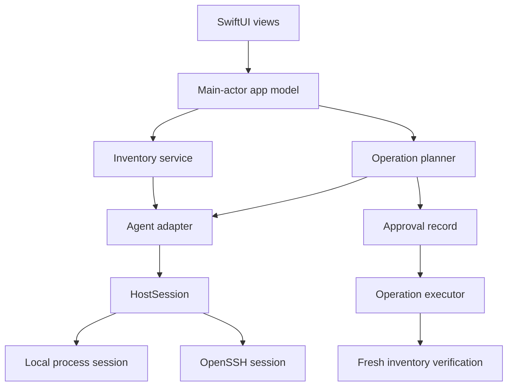
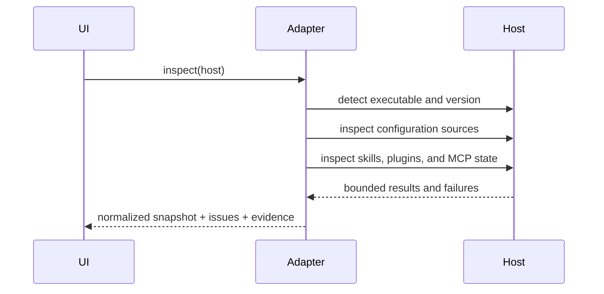

# Architecture

## System shape

Kitroom is a native macOS application with a UI target and a platform-neutral
core library. It connects to the local machine or to a remote host through the
user's OpenSSH configuration.



## Layers

### KitroomApp

Owns presentation, navigation, user interaction, accessibility, and main-actor
state. Views work with normalized core models and never construct shell
commands.

### KitroomCore.Domain

Contains immutable, `Sendable` values:

- `ManagedHost`
- `AgentKind`
- `ManagedExtension`
- `InventorySnapshot`
- `OperationPlan`

Unknown, partial, and unavailable states are first-class values.

### KitroomCore.Adapters

Each adapter understands one agent's:

- executable and capability discovery;
- configuration hierarchy;
- skills, plugins, and MCP surfaces;
- inventory formats;
- supported native operations;
- verification rules.

Candidate paths guide discovery but never prove installation by themselves.

### KitroomCore.Infrastructure

`HostSession` is the execution boundary shared by local and SSH connections.
Requests use an executable plus an argument array. Callers do not supply a
pre-concatenated shell string.

The first implementations should be:

- `LocalHostSession`, backed by `Process`;
- `SSHHostSession`, backed by `/usr/bin/ssh` and an existing host alias;
- fake and fixture sessions for tests.

## Inventory

An inventory scan is a collection of independently evidenced probes. A scan can
be complete, partial, or unavailable.



Raw command output should not become the public domain model. Adapters parse it
into normalized values and retain bounded evidence references for diagnostics.

## Mutations

Mutation is a state machine:

```text
draft → planned → awaiting approval → applying → verifying
      → completed | failed | rolled back | verification failed
```

An approval is valid only for the digest of the displayed plan. The digest
includes the host, agent, capability, inventory time, and exact changes. A live
state change requires a new plan and approval.

## Persistence

The initial persistence model should use a small local SQLite store or SwiftData
for:

- host metadata, excluding SSH private key material;
- normalized inventory snapshots;
- catalogue metadata;
- operation plans and status;
- redacted verification evidence.

Persistence technology is deferred until the inventory model has been exercised
against real local and Argus data.

## Extension points

New agents implement `AgentAdapter`. New transports implement `HostSession`.
New catalogue sources should normalize into a separate catalogue model rather
than masquerading as installed inventory.

