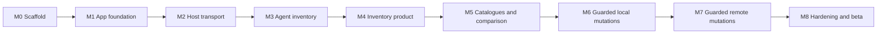

# Kitroom implementation plan

- **Status:** Proposed execution plan
- **Created:** 2026-07-27
- **Target:** Kitroom 1.0 for macOS
- **Initial agents:** Codex and Claude Code
- **Initial hosts:** The Mac running Kitroom and user-selected SSH hosts

## Outcome

Ship a signed and notarized macOS application that can:

1. discover Codex and Claude Code on the local machine and an SSH host;
2. build a fresh, evidence-backed inventory of skills, plugins, MCP servers,
   their scopes, origins, and effective states;
3. browse agent-native plugin marketplaces and the capabilities inside each
   plugin;
4. compare local and remote state;
5. preview, approve, apply, verify, and record supported installs, updates,
   enable/disable operations, and uninstalls;
6. recover from failed local or remote mutations without presenting unknown
   state as success.

Version 1.0 is complete only when the same guarded operation flow works on a
local machine and an SSH-accessible remote host.

## Delivery principles

- Read-only discovery comes before any mutation.
- Use the agents' supported CLI operations rather than editing their private
  caches.
- A plugin and the capabilities it provides are separate domain objects.
- Capability detection wins over assumptions based on a version string.
- Every inventory result includes capture time, source, scope, and evidence.
- Every mutation follows:

```text
inspect → plan → review → approve → apply → verify → record
```

- Approval binds to an immutable plan digest and expires when relevant state
  changes.
- Local and remote operations remain visually and operationally distinct.
- No `sudo`, private-key storage, disabled SSH host verification, or silent
  background synchronization in version 1.0.

## Current baseline

The scaffold already provides:

- SwiftUI application and `KitroomCore` package targets;
- host, agent, extension, inventory, and operation-plan types;
- Claude and Codex adapter boundaries;
- local/SSH session contracts;
- a plan approval digest;
- five passing domain and safety tests;
- product, architecture, security, roadmap, and agent guidance.

The initial adapter plan uses this CLI capability snapshot, captured on
2026-07-27:

| Surface | Observed version | Read-only interfaces | Mutation interfaces |
| --- | --- | --- | --- |
| Codex | `codex-cli 0.145.0` | `plugin list --json`, `plugin list --available --json`, `plugin marketplace list --json`, `mcp list --json` | `plugin add --json`, `plugin remove --json`, `plugin marketplace upgrade --json` |
| Claude Code | `2.1.207` | `plugin list --json`, `plugin list --available --json`, `plugin marketplace list --json`, `plugin details`, `mcp list` | scoped `plugin install`, `update`, `enable`, `disable`, and `uninstall` |

This table is test evidence, not a permanent compatibility contract. Each
adapter must probe the selected host and expose only the operations supported
there.

## Required domain refinement

The current `ManagedExtension` type is sufficient for the scaffold but too flat
for real inventory. Replace it before building the production inventory UI.

```text
CatalogSource
  └── PackageRecord
        ├── InstallationRecord
        └── ProvidedCapability[]
              ├── skill
              ├── MCP server
              ├── hook
              ├── subagent
              ├── connector
              ├── LSP server
              └── other
```

### Core records

- **PackageRecord:** stable package identity, agent, marketplace/source,
  publisher, version or revision, manifest digest, and declared components.
- **ProvidedCapability:** capability identity and kind, display metadata,
  package relationship, and agent-visible name.
- **InstallationRecord:** host, agent, scope, installed version, enabled state,
  physical origin, effective state, and any management restriction.
- **EvidenceRecord:** probe name, bounded source reference, captured time,
  parser version, success/partial/failure status, and redacted diagnostic.
- **CatalogSource:** agent-native marketplace or explicitly added source with
  freshness and trust metadata.
- **HostIdentity:** stable local or remote identity distinct from its editable
  display name or SSH alias.

### Required scopes and origins

The normalized model must preserve:

- user, repository/project, local-project, admin/managed, system/bundled, and
  session-only scopes;
- standalone, marketplace-installed, plugin-provided, shared, legacy,
  runtime-injected, and unknown origins;
- configured, enabled, disabled, pending approval, unavailable, unhealthy, and
  unknown effective states.

The UI can emphasize skills, plugins, and MCP servers while still showing every
component a plugin will add, including hooks and executables.

## Delivery sequence



Do not begin M7 remote mutations before the local mutation gate in M6 passes.

## M0: Scaffold

**Status:** Complete

### Delivered

- Swift package and SwiftUI shell
- Core domain and adapter boundaries
- Approval digest
- Initial safety tests
- Documentation and CI scaffold

### Gate

- `./scripts/verify.sh` passes
- `main` has a clean baseline commit

## M1: Application and distribution foundation

### Objective

Turn the Swift package executable into a maintainable macOS application bundle
without weakening the testable core.

### Work

1. Add a tracked Xcode macOS app project and retain `KitroomCore` as the
   independently testable library.
2. Establish the bundle identifier, deployment target, app group decision,
   versioning, signing configurations, and app icon placeholders.
3. Add development, test, and release build configurations.
4. Add structured logging through `os.Logger`, with privacy annotations and no
   raw command output in normal logs.
5. Add dependency injection for:
   - clock;
   - process execution;
   - host-session factory;
   - adapter registry;
   - persistence;
   - operation approval.
6. Run a short App Sandbox feasibility spike:
   - test access to user-selected `.codex`, `.agents`, `.claude`, and `.ssh`
     locations;
   - test launching the system `ssh` executable;
   - test persistence of security-scoped bookmarks;
   - document which required behaviours fail or add unacceptable friction.
7. Record ADR 0002 for distribution and sandboxing.

### Recommendation

Plan for direct Developer ID distribution with Hardened Runtime and
notarization. App Sandbox is required for Mac App Store distribution and limits
unrestricted home-directory access, so the final decision must follow the
feasibility spike rather than being assumed.

### Tests

- App launches from Xcode and command line.
- Core tests still run without the app target.
- Release configuration contains no debug entitlement.
- Logs redact values marked private.

### Exit gate

- A Debug `.app` launches successfully.
- ADR 0002 records the sandbox/distribution decision and its evidence.
- CI builds the app and runs the core tests.

## M2: Read-only host transport

### Objective

Reliably run bounded inspection commands on the local machine and a configured
remote host without changing either one.

### Work

1. Implement `ProcessExecutor`:
   - executable plus argument array;
   - explicit environment allowlist;
   - bounded stdout and stderr;
   - timeout and cooperative cancellation;
   - exit reason and signal reporting;
   - no implicit shell.
2. Implement `LocalHostSession`.
3. Implement `SSHHostSession` around `/usr/bin/ssh`:
   - accept only a validated OpenSSH alias;
   - reuse the user's existing OpenSSH configuration, agent, and host-key
     policy;
   - default automated probes to non-interactive authentication;
   - surface first-connection, authentication, timeout, and host-key errors
     separately;
   - do not copy or parse private keys.
4. Add a remote argument encoder:
   - no UI-generated arbitrary shell strings;
   - strict validation of identifiers;
   - POSIX quoting with unit and property tests;
   - fixed commands for host and adapter probes.
5. Implement host discovery:
   - effective SSH alias/config summary without secrets;
   - operating system, architecture, home directory, shell, and writable
     user-data locations;
   - agent executable paths and versions;
   - stable host-identity evidence;
   - capture time and latency.
6. Create fake sessions and fixture-driven transport tests.

### UI

- Replace hard-coded connection status with:
  - Not checked
  - Connecting
  - Reachable
  - Authentication required
  - Host identity changed
  - Unreachable
  - Partial discovery
- Show the resolved host separately from the friendly display name.

### Tests

- Large output truncation
- Timeout and cancellation
- Non-zero exit and signal
- Environment redaction
- Host-alias validation
- Argument encoding for spaces, quotes, Unicode, newlines, and metacharacters
- Connection loss during a probe

### Exit gate

- Kitroom can discover the local machine and a configured remote host
  read-only.
- No files, settings, marketplaces, or agent caches change during discovery.
- A failed probe produces partial or unavailable state, never an empty-success
  inventory.

## M3: Codex and Claude inventory adapters

### Objective

Produce normalized, evidence-backed inventories from each agent on each host.

### Shared adapter work

1. Add an adapter capability matrix populated at runtime.
2. Version every parser independently of the app version.
3. Store bounded raw fixtures for supported CLI outputs.
4. Distinguish:
   - configured state;
   - installed package state;
   - provided capabilities;
   - enabled/effective state;
   - runtime health.
5. Mark an inventory complete only when all required probes for that adapter
   succeed.

### Codex adapter

Inspect:

- `codex --version`;
- installed and available plugins through JSON CLI output;
- configured marketplaces through JSON CLI output;
- configured MCP servers through JSON CLI output;
- current `config.toml` layers relevant to skill enablement and plugin state;
- user skills in `$HOME/.agents/skills`;
- repository skills in `.agents/skills` from working directory to repository
  root;
- admin skills in `/etc/codex/skills` when readable;
- system/bundled skills reported by Codex.

Treat `$HOME/.codex/skills` as a compatibility or legacy probe only when it
exists on the selected host; current official documentation identifies
`$HOME/.agents/skills` as the user skill location.

Plugin-provided skills and MCP servers remain children of their installed
plugin package. Do not duplicate them as standalone installations.

### Claude adapter

Inspect:

- `claude --version`;
- installed and available plugins through JSON CLI output;
- marketplaces through JSON CLI output;
- plugin component detail;
- plugin user, project, local, and managed scopes;
- personal skills in `$HOME/.claude/skills`;
- project and nested skills in `.claude/skills`;
- legacy `.claude/commands` entries;
- plugin skills under their namespaced identity;
- configured MCP servers and project approval state;
- plugin cache metadata as supporting evidence, not the source of truth.

Claude plugin caches can retain orphaned versions after update or uninstall.
Kitroom must not interpret every cache directory as installed.

### MCP classification

For both agents, classify MCP servers as:

- directly configured;
- plugin-provided;
- connector/workspace-provided;
- built in;
- pending approval;
- disabled;
- unhealthy;
- unknown.

Agent-native commands manage plugin-provided servers; generic MCP removal must
not be offered for those entries.

### Tests

- Golden JSON and text fixtures for each supported CLI version
- Missing fields and forward-compatible unknown fields
- Malformed configuration
- Duplicate skill names across scopes
- Symlinked skills
- Plugin-provided capability de-duplication
- Plugin cache containing inactive/orphaned versions
- Partial MCP health failures
- Older CLI without a currently expected flag

### Exit gate

- Fresh inventories for Claude and Codex render correctly on the local machine
  and at least one SSH test host.
- Every displayed item has scope, origin, freshness, and evidence status.
- Unknown and partial results are plainly distinguishable.

## M4: Inventory product and persistence

### Objective

Turn normalized inventory into the first useful end-to-end product.

### Work

1. Choose SwiftData or SQLite in ADR 0003 after exercising the real inventory
   model. Prefer SwiftData unless migrations, query control, or audit integrity
   requirements justify another dependency.
2. Persist:
   - host metadata;
   - inventory snapshots;
   - evidence summaries;
   - scan issues;
   - later, catalogues and operation history.
3. Build the Hosts screen:
   - host identity and transport;
   - platform and agent versions;
   - connection status;
   - last successful and last attempted scans;
   - partial-state issues.
4. Build the Inventory screen:
   - host and agent filters;
   - package/capability hierarchy;
   - kind, scope, origin, enabled state, and update filters;
   - source and evidence inspector;
   - stale-state banner;
   - accessible keyboard navigation.
5. Add manual refresh and cancel.
6. Add a redacted diagnostic export.

### Tests

- Persistence migrations from an empty store
- Snapshot replacement versus historical retention
- Freshness transitions
- Search and filter correctness
- VoiceOver labels and keyboard focus order
- Diagnostic redaction

### Exit gate

- A user can answer what is installed, where it came from, which agent sees it,
  and whether the evidence is current on both hosts.
- No mutating controls are enabled yet.

## M5: Native catalogues, updates, and comparison

### Objective

Let users browse available packages and understand differences before enabling
changes.

### Work

1. Build catalogue collectors from agent-native interfaces:
   - Codex `plugin list --available --json`;
   - Claude `plugin list --available --json`;
   - configured marketplace metadata from each agent.
2. Normalize catalogues without erasing agent-specific identity or scope.
3. Show:
   - source marketplace;
   - publisher and repository when declared;
   - installed and available versions/revisions;
   - declared skills, MCP servers, hooks, executables, and other components;
   - compatibility and management restrictions;
   - source freshness and integrity evidence.
4. Add host-to-host comparison:
   - only here;
   - missing there;
   - version mismatch;
   - enabled-state mismatch;
   - same name but different source or digest;
   - incomparable or unknown.
5. Add update detection without applying updates.
6. Treat agent-specific update support honestly:
   - Claude has a direct scoped plugin update operation in the observed
     baseline;
   - Codex update behaviour must be capability-tested because the observed CLI
     exposes marketplace upgrade but no separate plugin update subcommand.
7. Defer arbitrary internet-wide skill search until a provenance and integrity
   policy is defined.

### Tests

- Installed/available joins
- Same-name packages from different marketplaces
- Version and digest comparison
- Stale marketplace snapshots
- Missing publisher or revision
- Agent without a supported update path

### Exit gate

- A user can browse native marketplaces and compare a local machine with a
  remote host.
- The UI never represents marketplace refresh as installed-package update.
- No reconciliation occurs automatically.

## M6: Guarded local mutations

### Objective

Safely change user-level Claude and Codex capability state on the local
machine.

### Operation engine

1. Add explicit states:

```text
draft → planned → awaiting approval → applying → verifying
      → completed | failed | rolled back | verification failed
```

2. A plan contains:
   - stable host identity;
   - agent and capability;
   - source, scope, version/revision, and content digest;
   - exact native CLI calls and filesystem targets;
   - expected before/after state;
   - risk and warnings;
   - backup and rollback steps;
   - verification probes;
   - creation and expiry times.
3. Bind approval to the existing digest.
4. Re-scan relevant state immediately before apply. Invalidate the plan if it
   differs.
5. Store backups under a private Kitroom application-support directory with
   restrictive permissions and a documented retention policy.
6. Write standalone skills through staging, validation, digesting, and atomic
   rename.
7. Use native CLI operations for plugins, marketplaces, and MCP configuration
   whenever supported. Never edit an agent's plugin cache directly.
8. Re-run the relevant inventory probes after apply.

### Implementation order

1. Install and uninstall one standalone local skill in an isolated temporary
   profile.
2. Enable and disable a Claude plugin.
3. Install, update, and uninstall a Claude plugin.
4. Install and remove a Codex plugin.
5. Add and remove one directly configured MCP server.
6. Add standalone-skill update after source integrity is defined.

Each path gets its own review and gate. Do not implement a generic "run command"
mutation endpoint.

### Tests

- Plan expiry and state-change invalidation
- Idempotent no-op
- Backup creation and permission checks
- Atomic-write interruption
- Native CLI failure after partial output
- Verification mismatch
- Rollback success and rollback failure
- Plugin-provided MCP removal blocked from the generic MCP path
- Secrets removed from plan, activity, and diagnostics

### Exit gate

- Every supported local operation shows its exact effect before approval.
- A completed result has fresh matching evidence.
- Failures retain a recoverable backup and actionable state.
- Mutation tests use temporary profiles, never real user agent directories.

## M7: Guarded remote mutations

### Objective

Apply the proven operation engine over SSH without introducing a remote daemon
or weakening host identity and recovery guarantees.

### Work

1. Bind plans to the verified remote identity. The editable SSH alias alone is
   insufficient.
2. Re-run reachability, identity, agent-version, permissions, exposure, and
   freshness checks immediately before approval and apply.
3. Use fixed, versioned remote operation envelopes. User and catalogue values
   remain data, not executable shell fragments.
4. Transfer files with an explicit staging path and content digest.
5. Store remote backups under a private user-level Kitroom data directory.
6. Apply through atomic rename where the remote filesystem supports it.
7. Handle:
   - connection loss before apply;
   - connection loss during apply;
   - apply success with missing verification;
   - changed host identity;
   - changed agent version or configuration;
   - insufficient permissions or disk space;
   - rollback failure.
8. First test the full flow against a disposable remote fixture directory and
   isolated agent profile.
9. Require a separate explicit approval before the first operation that can
   affect any non-fixture remote Claude or Codex configuration.

### Tests

- Local SSH fixture with controlled disconnects
- Remote path and argument injection cases
- Content digest mismatch
- Insufficient disk and permissions
- Atomic rename unsupported
- Host identity change
- Verification unavailable after successful command

### Exit gate

- One standalone skill and one agent-native plugin operation complete on an
  isolated remote profile with matching verification.
- Recovery behaviour is demonstrated for an interrupted remote operation.
- Only then may a separately approved operation target a user-selected remote
  host outside the test environment.

## M8: Hardening and beta release

### Objective

Turn the proven workflows into a distributable beta.

### Work

1. Complete accessibility and keyboard-navigation review.
2. Add empty, loading, stale, partial, denied, offline, and recovery states for
   every core screen.
3. Add operation history, backup retention controls, and deletion confirmation.
4. Complete threat-model review for:
   - untrusted catalogue data;
   - malicious plugin manifests;
   - path traversal and symlink attacks;
   - command and argument injection;
   - secret leakage;
   - SSH host substitution;
   - rollback tampering.
5. Add package-source allowlists and digest policy.
6. Sign with Developer ID, enable Hardened Runtime, notarize, staple, and test
   Gatekeeper behaviour.
7. Produce a DMG or ZIP distribution and release checklist.
8. Keep update checking manual or notification-only for the first beta.
9. Add privacy and diagnostic-data documentation.

### Release acceptance matrix

| Scenario | Local host | Remote host |
| --- | --- | --- |
| Detect Claude and Codex | Required | Required |
| Complete/partial inventory | Required | Required |
| Browse native catalogues | Required | Required |
| Compare hosts | Required | Required |
| Skill install/update/uninstall | Required | Required |
| Plugin install/update/enable/disable/uninstall when agent supports it | Required | Required |
| MCP direct-config management | Required | Required |
| Plan approval and invalidation | Required | Required |
| Backup, verification, and rollback evidence | Required | Required |
| Redacted diagnostics | Required | Required |

### Exit gate

- All required matrix rows pass.
- Release build is signed, notarized, and accepted by Gatekeeper.
- No known critical or high-severity security findings remain.
- Documentation describes only implemented behaviour.

## First implementation slices

Keep pull requests narrow and independently verifiable:

1. Xcode app target and ADR 0002 sandbox spike
2. `ProcessExecutor`, fake executor, timeouts, and output limits
3. `LocalHostSession` and local host discovery
4. `SSHHostSession` and read-only remote-host discovery
5. Domain refinement for packages, capabilities, installations, and evidence
6. Codex JSON inventory and fixture tests
7. Claude plugin JSON inventory and fixture tests
8. Claude skills/MCP inventory and partial-state handling
9. Codex skills/MCP inventory and origin de-duplication
10. Hosts and inventory UI
11. Persistence and redacted diagnostics
12. Native catalogue browsing and host comparison
13. Operation planner and review UI
14. Isolated local standalone-skill install/uninstall
15. Claude plugin mutation paths
16. Codex plugin mutation paths
17. Direct MCP mutation paths
18. Isolated remote-host operation
19. Security review, signing, notarization, and beta packaging

Each slice must update tests and relevant documentation in the same change.

## Test environments

### Unit

- Pure domain, normalization, plan, digest, redaction, and quoting tests
- No real home-directory or network access

### Parser fixtures

- Sanitized outputs captured from supported Codex and Claude versions
- Golden expected normalized inventory
- Malformed, partial, future-field, and older-version variants

### Local integration

- Temporary home and agent configuration roots
- Fake marketplace repositories
- No writes to real user `.codex`, `.agents`, or `.claude` directories

### SSH integration

- Disposable local or CI SSH account
- Controlled permissions, disk failures, disconnects, and host-key changes
- No mutation tests against live or production remote hosts

### Live smoke

- Explicitly selected
- Read-only until M7's isolated remote gate passes
- Fresh evidence recorded for both local and configured remote test hosts

## Risk register

| Risk | Mitigation |
| --- | --- |
| Agent CLI or output changes | Capability probes, versioned parsers, fixtures, unknown-state fallback |
| Plugin cache mistaken for installed state | Agent-native inventory is authoritative; cache is evidence only |
| Plugin hides hooks or executables | Parse and display the complete component inventory before approval |
| Remote shell injection | Fixed operation envelopes, strict identifiers, quoting tests, no arbitrary command UI |
| SSH alias resolves to a different host | Bind plans and history to verified host identity |
| Command succeeds but agent state does not change | Mandatory post-change inventory verification |
| Partial remote mutation | Staging, atomic apply, backups, explicit indeterminate state, recovery workflow |
| Credentials leak into logs | Structured redaction, bounded evidence, privacy-aware logging, fixture scanning |
| Sandboxing blocks core workflows | Early feasibility spike and documented direct-distribution decision |
| Marketplace trust is mistaken for safety | Separate source, integrity, publisher, and review status |

## Deferred until after 1.0

- Additional agents
- Mac App Store distribution
- Root or system-package management
- Automatic cross-host synchronization
- Team RBAC and policy distribution
- Public marketplace aggregation beyond agent-native sources
- Background remote monitoring or a resident remote-host daemon
- Agent-session orchestration, token use, and cost tracking
- Windows or Linux desktop clients

## Plan maintenance

- Update milestone checkboxes in `ROADMAP.md`.
- Keep this document focused on sequence, gates, and implementation contracts.
- Record architectural changes in `docs/decisions/`.
- Re-run CLI capability discovery before starting an adapter or mutation slice.
- Revise the compatibility table when a tested version changes behaviour.
- Do not mark a milestone complete until its exit gate is evidenced.

## Current source references

These references informed the plan and should be refreshed when adapter work
starts:

- [OpenAI Codex manual](https://developers.openai.com/codex/codex-manual.md)
- [OpenAI plugin documentation](https://developers.openai.com/plugins/)
- [Claude Code skills](https://code.claude.com/docs/en/slash-commands)
- [Claude Code plugin discovery and management](https://code.claude.com/docs/en/discover-plugins)
- [Claude Code plugin reference](https://code.claude.com/docs/en/plugins-reference)
- [Claude Code MCP](https://code.claude.com/docs/en/mcp)
- [Apple App Sandbox](https://developer.apple.com/documentation/security/app-sandbox)
- [Apple notarization](https://developer.apple.com/documentation/security/notarizing-macos-software-before-distribution)
